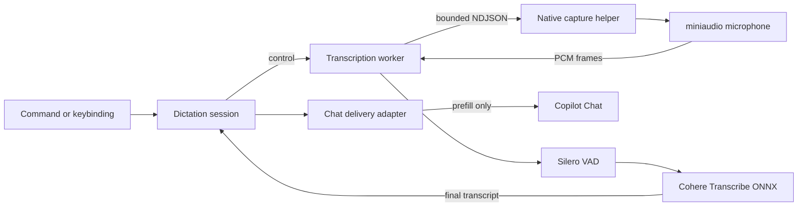

<h1>Copilot Speech</h1>

  <b>Private, local voice dictation for GitHub Copilot Chat in desktop VS Code</b> 
  Speak naturally. Review the prompt. Send when you are ready.

  
  
  
  

Copilot Speech captures microphone audio in an isolated native helper (miniaudio), strips non-speech with Silero VAD, transcribes locally with [Cohere Transcribe](https://huggingface.co/CohereLabs/cohere-transcribe-03-2026), and prefills Copilot Chat for review. No cloud transcription service, no automatic submission, and no transcript history.

## Highlights

- **Powered by Cohere Transcribe** - a 2B-parameter multilingual speech model (Apache-2.0) runs entirely on your machine through [Transformers.js](https://huggingface.co/docs/transformers.js) and ONNX Runtime. Nothing is ever sent to the cloud. The model (~1.5 GB, `q4f16`) is downloaded and cached the first time you dictate.
- **Your voice stays private** - audio never leaves your device, stays out of the extension host, and no transcript history is kept.
- **Silero voice activity detection** - neural VAD removes silence and background noise before transcription so the model sees clean speech.
- **Speak your language** - choose from 14 languages including English, German, French, Spanish, Italian, Portuguese, Dutch, Polish, Greek, Arabic, Japanese, Chinese, Vietnamese, or Korean. Cohere Transcribe does not auto-detect language, so pick the one you will speak.

## Quickstart

Requires **desktop VS Code 1.124+** (not the browser).

1. Install **Copilot Speech** from the Extensions view.
2. Press `Ctrl+Alt+V` / `Cmd+Alt+V` (or run **Copilot Speech: Start Chat Dictation**).
3. Speak, then press the same shortcut again to stop. The transcript is prefilled into Copilot Chat — review and send when ready.
4. Press `Escape` while recording to cancel and discard.

Optional: set `copilotSpeech.language` to the language you will speak (default English). The first run downloads the Cohere Transcribe model (~1.5 GB) and caches it for later.

## How it works

Microphone capture lives in a small native helper (miniaudio) — the only place VS Code allows microphone access — while Silero VAD and speech recognition run in a Node worker thread, off the extension-host thread.

The native helper only captures audio and streams raw PCM; it contains no ML code. On stop, the worker runs Silero VAD over the recording, then transcribes the remaining speech once. This keeps audio off the extension-host thread, prevents a helper crash from taking down VS Code, and avoids Electron/Node native-addon ABI coupling in the capture process.

## Reference

<b>Commands and shortcuts</b>

| Command | Shortcut | Purpose |
| --- | --- | --- |
| `Copilot Speech: Start Chat Dictation` | `Ctrl+Alt+V` / `Cmd+Alt+V` | Start a new local dictation session |
| `Copilot Speech: Stop Dictation` | Same toggle | Finish dictation and deliver the final text |
| `Copilot Speech: Cancel Dictation` | `Escape` while recording | Discard the active session |

<b>Settings</b>

| Setting | Default | Description |
| --- | --- | --- |
| `copilotSpeech.language` | `en` | Language you will speak (Cohere Transcribe does not auto-detect) |
| `copilotSpeech.helperPath` | `""` | Development path to a native capture helper build |

## License

[MIT](./LICENSE.md)
