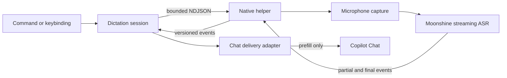

<h1>Copilot Speech</h1>

  <b>Private, local voice dictation for GitHub Copilot Chat in desktop VS Code</b> 
  Speak naturally. Review the prompt. Send when you are ready.

  
  
  
  

Copilot Speech keeps microphone audio inside an isolated native helper, transcribes it with a local streaming model, and prefills Copilot Chat for review. No cloud transcription service, no automatic submission, and no transcript history.

## Highlights

- **Powered by Moonshine AI** - speech recognition runs entirely on your machine with the local [Moonshine](https://github.com/moonshine-ai/moonshine) Medium Streaming model. [Moonshine's benchmarks](https://github.com/moonshine-ai/moonshine#when-should-you-choose-moonshine-over-whisper) put Medium Streaming at **6.65% WER** on the [OpenASR leaderboard](https://huggingface.co/spaces/hf-audio/open_asr_leaderboard) — better than Whisper Large v3 (7.44%) with about one-sixth the parameters (245M vs 1.5B) and end-of-phrase latency around **100ms** for short utterances instead of multi-second waits. Nothing is ever sent to the cloud.
- **Your voice stays private** - audio never leaves your device, and no transcript history is kept.
- **Responsive as you speak** - text appears live while you talk, so you always know it's listening.
- **Speak your language** - choose English, Arabic, Spanish, Japanese, Korean, Ukrainian, Vietnamese, or Chinese. Non-English Moonshine model weights use the [Moonshine Community License](https://moonshine.ai/license) for non-commercial use.

## Quickstart

Requires **desktop VS Code 1.124+** (not the browser).

1. Install **Copilot Speech** from the Extensions view.
2. Press `Ctrl+Alt+V` / `Cmd+Alt+V` (or run **Copilot Speech: Start Chat Dictation**).
3. Speak. Partial text appears as you talk.
4. Press the same shortcut again to stop. The final transcript is prefilled into Copilot Chat — review and send when ready.
5. Press `Escape` while recording to cancel and discard.

Optional: set `copilotSpeech.language` if you are not dictating in English. The first run downloads the local Moonshine model for that language.

## How it works

The extension coordinates a local helper process instead of loading microphone or inference code into the extension host.

The helper owns raw PCM, capture, voice activity detection, and inference. This keeps audio outside the extension host, prevents a helper crash from taking down VS Code, and avoids Electron or Node native-addon ABI coupling.

## Reference

<b>Commands and shortcuts</b>

| Command | Shortcut | Purpose |
| --- | --- | --- |
| `Copilot Speech: Start Chat Dictation` | `Ctrl+Alt+V` / `Cmd+Alt+V` | Start a new local dictation session |
| `Copilot Speech: Stop Dictation` | Same toggle | Finish dictation and deliver the final text |
| `Copilot Speech: Cancel Dictation` | `Escape` while recording | Discard the active session |

<b>Settings</b>

| Setting | Default | Description |
| --- | --- | --- |
| `copilotSpeech.language` | `en` | Recognition language and local Moonshine model to use |
| `copilotSpeech.helperPath` | `""` | Development path to a native helper build |
| `copilotSpeech.modelPath` | `""` | Development path to an unpacked Moonshine model |

## License

[MIT](./LICENSE.md)
