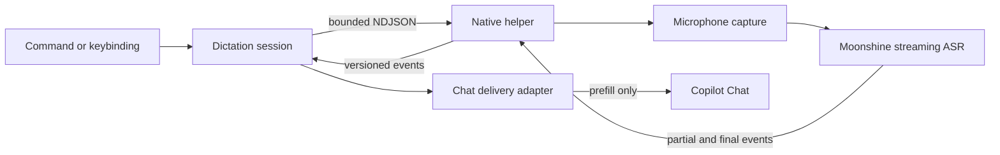

<div align="center">


<h1>Copilot Speech</h1>

<p>
  <b>Private, local voice dictation for GitHub Copilot Chat in desktop VS Code</b><br/>
  <sub>Speak naturally. Review the prompt. Send when you are ready.</sub>
</p>

<p>
  
  
  
  <a href="./LICENSE.md"></a>
</p>

</div>

Copilot Speech keeps microphone audio inside an isolated native helper, transcribes it with a local streaming model, and prefills Copilot Chat for review. No cloud transcription service, no automatic submission, and no transcript history.

## Highlights

- **Local by design** - raw audio stays in the native helper and never enters the VS Code extension host.
- **Review before send** - final text is placed in Copilot Chat as an editable draft, never submitted automatically.
- **Streaming first** - the architecture is designed for partial transcripts, voice activity detection, and responsive endpointing.
- **Quality or speed** - choose Moonshine Medium for recognition quality or Small for a lighter footprint.
- **Remote-workspace friendly** - the extension runs beside the desktop UI and microphone while your code can live in SSH, WSL, or a Dev Container.
- **Failure isolated** - inference runs out of process behind a versioned, bounded NDJSON protocol.

## Try the draft

> Requires **VS Code 1.124+**, **Node.js 24**, **pnpm 11**, **CMake 3.20+**, and a **C++20 compiler**.

1. **Install and validate the extension.**

	```bash
	pnpm install
	pnpm check
	pnpm ext:package
	```

2. **Build the native protocol stub.**

	```bash
	pnpm native:configure
	pnpm native:build
	pnpm native:test
	```

3. **Point Copilot Speech at the helper.** Set `copilotSpeech.helperPath` to the built executable. On Linux, the default build location is:

	```text
	native/voice-helper/build/copilot-speech-helper
	```

4. **Launch an end-to-end synthetic transcript.**

	```bash
	COPILOT_SPEECH_STUB_TRANSCRIPT="Explain the selected function" code .
	```

Start dictation, then stop it. The helper emits the synthetic final transcript and Copilot Speech prefills Chat without submitting it.

## How it works

The extension coordinates a local helper process instead of loading microphone or inference code into the extension host.



The helper owns raw PCM, capture, voice activity detection, and inference. This keeps audio outside the extension host, prevents a helper crash from taking down VS Code, and avoids Electron or Node native-addon ABI coupling.

## Models

The draft catalog uses English streaming models from Moonshine Voice v2.

| Model | Parameters | Required files | Role |
| --- | ---: | ---: | --- |
| Moonshine Medium Streaming English | 245M | 289.3 MiB | Default, best quality |
| Moonshine Small Streaming English | 123M | 157.1 MiB | Faster, lighter option |

The optional `decoder_kv_with_attention.ort` files are excluded because dictation does not require word-level timestamps. Published model URLs are recorded in [`artifacts/model-manifest.json`](artifacts/model-manifest.json), but SHA-256 values remain pending until immutable release artifacts are pinned. Production code must not install or execute an artifact without digest verification.

## Reference

<details>
<summary><b>Commands and shortcuts</b></summary>

| Command | Shortcut | Purpose |
| --- | --- | --- |
| `Copilot Speech: Start Chat Dictation` | `Ctrl+Alt+V` / `Cmd+Alt+V` | Start a new local dictation session |
| `Copilot Speech: Stop Dictation` | Same toggle | Finish dictation and deliver the final text |
| `Copilot Speech: Cancel Dictation` | `Escape` while recording | Discard the active session |
| `Copilot Speech: Select Microphone` | - | Choose a local capture device |
| `Copilot Speech: Show Diagnostics` | - | Inspect state and non-content diagnostics |
| `Copilot Speech: Open Settings` | - | Open extension settings |

</details>

<details>
<summary><b>Settings</b></summary>

| Setting | Default | Description |
| --- | --- | --- |
| `copilotSpeech.model` | `medium-streaming-en` | Local Moonshine model used for dictation |
| `copilotSpeech.microphone` | `default` | Microphone device identifier |
| `copilotSpeech.helperPath` | `""` | Development path to a native helper build |
| `copilotSpeech.modelPath` | `""` | Development path to an unpacked Moonshine model |
| `copilotSpeech.debug` | `false` | Write protocol and timing diagnostics without transcript text or audio |

</details>

<details>
<summary><b>Remote workspaces</b></summary>

Copilot Speech declares `extensionKind: ["ui"]`, so it runs next to the desktop UI and local microphone while source files may live in Remote SSH, WSL, or Dev Containers. Browser-hosted VS Code is out of scope because it cannot run the native helper.

</details>

## Development

```bash
pnpm install
pnpm check          # lint + typecheck + tests + coverage + build
pnpm ext:package    # produce an installable .vsix
```

Native helper commands:

```bash
pnpm native:configure
pnpm native:build
pnpm native:test
```

## Roadmap

1. Pin Moonshine Voice and ONNX Runtime source revisions.
2. Replace the protocol stub with Moonshine streaming inference.
3. Add WASAPI, Core Audio, PulseAudio, and ALSA microphone capture.
4. Publish signed helpers for Linux, macOS, and Windows.
5. Add checksum-verified model/runtime installation under `globalStorageUri`.
6. Benchmark Medium and Small on representative hardware and tune endpointing.
7. Run clean-machine microphone permission and remote-workspace acceptance tests.

## License

[MIT](./LICENSE.md) - see [`THIRD_PARTY_NOTICES.md`](THIRD_PARTY_NOTICES.md) for planned runtime and model dependencies.
