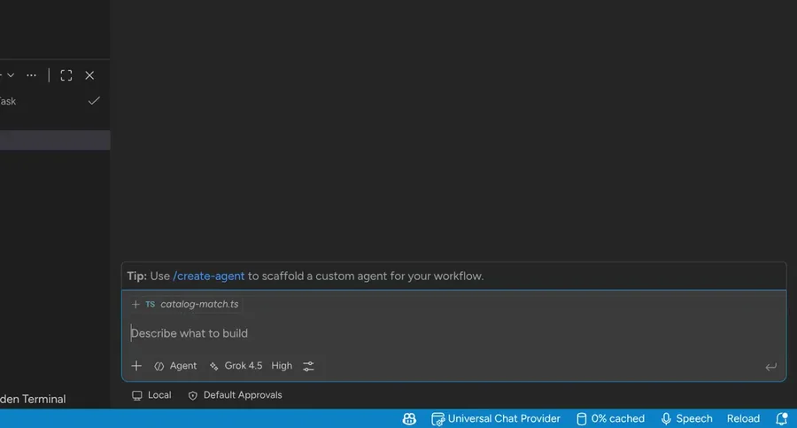
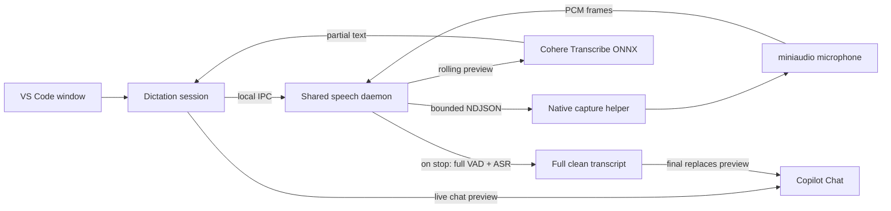

<h1>Copilot Speech</h1>

  <b>Private, local voice dictation for GitHub Copilot Chat in desktop VS Code</b> 
  Speak naturally. Review the prompt. Send when you are ready.

	
	
  
  

I built Copilot Speech because [VS Code Speech](https://marketplace.visualstudio.com/items?itemName=ms-vscode.vscode-speech) was not reliable enough for daily Copilot Chat dictation — flaky sessions, inconsistent quality, and cloud speech I did not want handling private work audio.

Copilot Speech captures microphone audio in an isolated native helper (miniaudio), strips non-speech with Silero VAD, transcribes locally with [Cohere Transcribe](https://huggingface.co/CohereLabs/cohere-transcribe-03-2026), and prefills Copilot Chat for review. No cloud transcription service, no automatic submission, and no transcript history.

## Demo

## Highlights

- **Powered by Cohere Transcribe** — a 2B-parameter multilingual speech model (Apache-2.0) runs entirely on your machine through [Transformers.js](https://huggingface.co/docs/transformers.js) and ONNX Runtime. Nothing is ever sent to the cloud. The model (~1.5 GB, `q4f16`) is downloaded and cached the first time you dictate.
- **GPU accelerated when available** — Copilot Speech tries WebGPU first for faster transcription and automatically falls back to CPU, where it also runs well.
- **Strong accuracy** — **5.42%** average WER on the [Open ASR Leaderboard](https://huggingface.co/spaces/hf-audio/open_asr_leaderboard) (vs **7.44%** for Whisper Large v3). See [Model benchmarks](#model-benchmarks).
- **Your voice stays private** — audio never leaves your device, stays out of the extension host, and no transcript history is kept.
- **Silero voice activity detection** — neural VAD removes silence and background noise before transcription so the model sees clean speech.
- **Speak your language** — choose from 14 languages including English, German, French, Spanish, Italian, Portuguese, Dutch, Polish, Greek, Arabic, Japanese, Chinese, Vietnamese, or Korean. Cohere Transcribe does not auto-detect language, so pick the one you will speak.

## Model benchmarks

**Word error rate (WER)** is the share of words a model gets wrong. Lower is better.

On the [Open ASR Leaderboard](https://huggingface.co/spaces/hf-audio/open_asr_leaderboard) English suite, Cohere Transcribe currently ranks first. Compared with Whisper Large v3 — the familiar open baseline — that is **~27% fewer word errors** (5.42% vs 7.44%).

| Rank | Model | Average WER |
| ---: | --- | ---: |
| 1 | **Cohere Transcribe** (this extension) | **5.42%** |
| 2 | Zoom Scribe v1 | 5.47% |
| 3 | IBM Granite 4.0 1B Speech | 5.52% |
| 4 | NVIDIA Canary Qwen 2.5B | 5.63% |
| 5 | Qwen3-ASR-1.7B | 5.76% |
| 6 | ElevenLabs Scribe v2 | 5.83% |
| … | OpenAI Whisper Large v3 | 7.44% |

Source: [Cohere](https://cohere.com/blog/transcribe) (2026-03-26). This extension runs the local ONNX build, not a cloud API.

## Quickstart

Requires **desktop VS Code 1.124+** (not the browser).

1. Install **Copilot Speech** from the Extensions view.
2. Press `Ctrl+Alt+V` / `Cmd+Alt+V` (or run **Copilot Speech: Start Chat Dictation**).
3. Speak, then press the same shortcut again to stop. The transcript is prefilled into Copilot Chat — review and send when ready.
4. Press `Escape` while recording to cancel and discard.

Optional: set `copilotSpeech.language` to the language you will speak (default English). The first run downloads the Cohere Transcribe model (~1.5 GB) and caches it for later.

## How it works

Microphone capture lives in a small native helper (miniaudio) — the only place VS Code allows microphone access — while Silero VAD and speech recognition run in one local daemon shared by all VS Code windows.

The native helper only captures audio and streams raw PCM; it contains no ML code. While you speak, the daemon periodically transcribes a recent speech window and shows approximate text in Copilot Chat for feedback. On stop, it runs Silero VAD over the full recording and re-transcribes once for a clean final result that replaces the preview. The daemon keeps one model loaded across VS Code windows and exits when the final window disconnects or after the configured inactivity timeout.

## Reference

<b>Commands and shortcuts</b>

| Command | Shortcut | Purpose |
| --- | --- | --- |
| `Copilot Speech: Start Chat Dictation` | `Ctrl+Alt+V` / `Cmd+Alt+V` | Start a new local dictation session |
| `Copilot Speech: Stop Dictation` | Same toggle | Finish dictation and deliver the final text |
| `Copilot Speech: Cancel Dictation` | `Escape` while recording | Discard the active session |
| `Copilot Speech: Show Logs` | — | Open the Copilot Speech output log |
| `Copilot Speech: Delete Downloaded Model` | — | Delete the cached model; it downloads again on the next dictation |
| `Copilot Speech: Open Speech Settings` | — | Open the extension settings in VS Code |

<b>Settings</b>

| Setting | Default | Description |
| --- | --- | --- |
| `copilotSpeech.language` | `en` | Language you will speak (Cohere Transcribe does not auto-detect) |
| `copilotSpeech.device` | `auto` | Recognition hardware: try WebGPU with CPU fallback (`auto`), require WebGPU (`gpu`), or always use the CPU (`cpu`) |
| `copilotSpeech.modelIdleMinutes` | `15` | Minutes of inactivity before stopping the shared speech runtime (`0` keeps it running while a VS Code window remains connected) |

## License

[MIT](./LICENSE.md)
