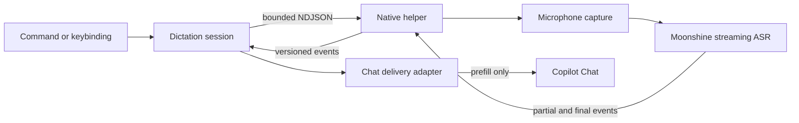

<div align="center">


<h1>Copilot Speech</h1>

<p>
  <b>Private, local voice dictation for GitHub Copilot Chat in desktop VS Code</b><br/>
  <sub>Speak naturally. Review the prompt. Send when you are ready.</sub>
</p>

<p>
  
  
  
  <a href="./LICENSE.md"></a>
</p>

</div>

Copilot Speech keeps microphone audio inside an isolated native helper, transcribes it with a local streaming model, and prefills Copilot Chat for review. No cloud transcription service, no automatic submission, and no transcript history.

## Highlights

- **Local by design** - raw audio stays in the native helper and never enters the VS Code extension host.
- **Review before send** - final text is placed in Copilot Chat as an editable draft, never submitted automatically.
- **Streaming first** - partial transcripts keep the recording status responsive while Moonshine Medium handles final recognition.
- **Remote-workspace friendly** - the extension runs beside the desktop UI and microphone while your code can live in SSH, WSL, or a Dev Container.
- **Failure isolated** - inference runs out of process behind a versioned, bounded NDJSON protocol.

## Try the draft

> Requires **VS Code 1.124+**, **Node.js 24**, **pnpm 11**, **CMake 3.20+**, and a **C++20 compiler**.

1. **Install and validate the extension.**

	```bash
	pnpm install
	pnpm check
	```

2. **Build and test the native helper.**

	```bash
	pnpm native:configure
	pnpm native:build
	pnpm native:test
	pnpm ext:package
	```

3. **Point Copilot Speech at the helper.** Set `copilotSpeech.helperPath` to the packaged executable. On Linux, the default location is:

	```text
	runtime/linux-x64/copilot-speech-helper
	```

	Packaged releases select the matching `linux-x64`, `win32-x64`, or `darwin-arm64` runtime automatically, so this setting is only needed for helper development.

4. **Launch an end-to-end synthetic transcript.**

	```bash
	COPILOT_SPEECH_STUB_TRANSCRIPT="Explain the selected function" code .
	```

Start dictation, then stop it. The helper emits the synthetic final transcript and Copilot Speech prefills Chat without submitting it.

## How it works

The extension coordinates a local helper process instead of loading microphone or inference code into the extension host.



The helper owns raw PCM, capture, voice activity detection, and inference. This keeps audio outside the extension host, prevents a helper crash from taking down VS Code, and avoids Electron or Node native-addon ABI coupling.

## Reference

<details>
<summary><b>Commands and shortcuts</b></summary>

| Command | Shortcut | Purpose |
| --- | --- | --- |
| `Copilot Speech: Start Chat Dictation` | `Ctrl+Alt+V` / `Cmd+Alt+V` | Start a new local dictation session |
| `Copilot Speech: Stop Dictation` | Same toggle | Finish dictation and deliver the final text |
| `Copilot Speech: Cancel Dictation` | `Escape` while recording | Discard the active session |

</details>

<details>
<summary><b>Settings</b></summary>

| Setting | Default | Description |
| --- | --- | --- |
| `copilotSpeech.helperPath` | `""` | Development path to a native helper build |
| `copilotSpeech.modelPath` | `""` | Development path to an unpacked Moonshine model |

</details>

<details>
<summary><b>Remote workspaces</b></summary>

Copilot Speech declares `extensionKind: ["ui"]`, so it runs next to the desktop UI and local microphone while source files may live in Remote SSH, WSL, or Dev Containers. Browser-hosted VS Code is out of scope because it cannot run the native helper.

</details>

## Development

```bash
pnpm install
pnpm check          # lint + typecheck + tests + build
pnpm ext:package    # produce an installable .vsix
```

Native helper commands:

```bash
pnpm native:configure
pnpm native:build
pnpm native:test
```

Native helper source lives under `src/native/`. Build dependencies and intermediates stay under `build/native/`; generated helper binaries are staged under the ignored `runtime/<platform>-<arch>/` tree for packaging.

Release packages are platform-specific: `linux-x64`, `win32-x64`, and `darwin-arm64`. Each VSIX contains only the matching helper runtime.

## License

[MIT](./LICENSE.md) - see [`THIRD_PARTY_NOTICES.md`](THIRD_PARTY_NOTICES.md) for planned runtime and model dependencies.
