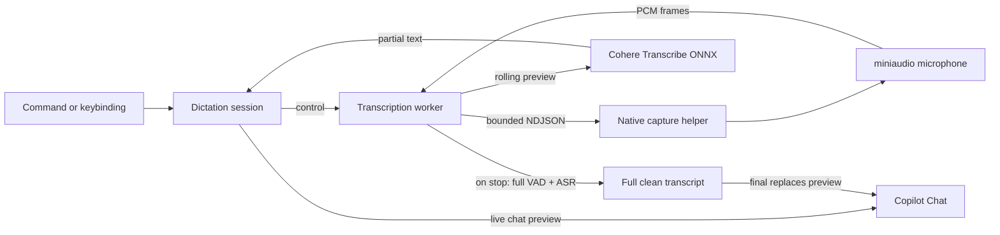

<h1>Copilot Speech</h1>

  <b>Private, local voice dictation for GitHub Copilot Chat</b> 
  Built because VS Code Speech was not reliable enough. Speak. Review. Send when ready.

  
  
  
  

## Highlights

- **Powered by Cohere Transcribe** — a 2B-parameter multilingual speech model (Apache-2.0) runs entirely on your machine through [Transformers.js](https://huggingface.co/docs/transformers.js) and ONNX Runtime. Nothing is ever sent to the cloud. The model (~1.5 GB, `q4f16`) is downloaded and cached the first time you dictate.
- **Strong accuracy** — **5.42%** average WER on the [Open ASR Leaderboard](https://huggingface.co/spaces/hf-audio/open_asr_leaderboard) (vs **7.44%** for Whisper Large v3). See [Model benchmarks](#model-benchmarks).
- **Your voice stays private** — audio never leaves your device, stays out of the extension host, and no transcript history is kept.
- **Silero voice activity detection** — neural VAD removes silence and background noise before transcription so the model sees clean speech.
- **Speak your language** — choose from 14 languages including English, German, French, Spanish, Italian, Portuguese, Dutch, Polish, Greek, Arabic, Japanese, Chinese, Vietnamese, or Korean. Cohere Transcribe does not auto-detect language, so pick the one you will speak.

## Model benchmarks

Cohere Transcribe leads English ASR accuracy on the [Open ASR Leaderboard](https://huggingface.co/spaces/hf-audio/open_asr_leaderboard) (lower WER is better):

| Model | Avg | AMI | Earnings22 | Gigaspeech | LS clean | LS other | SPGISpeech | TED-LIUM | VoxPopuli |
| --- | ---: | ---: | ---: | ---: | ---: | ---: | ---: | ---: | ---: |
| **Cohere Transcribe** | **5.42** | **8.13** | 10.86 | 9.34 | **1.25** | **2.37** | 3.08 | 2.49 | 5.87 |
| Zoom Scribe v1 | 5.47 | 10.03 | 9.53 | 9.61 | 1.63 | 2.81 | **1.59** | 3.22 | **5.37** |
| IBM Granite 4.0 1B Speech | 5.52 | 8.44 | **8.48** | 10.14 | 1.42 | 2.85 | 3.89 | 3.10 | 5.84 |
| NVIDIA Canary Qwen 2.5B | 5.63 | 10.19 | 10.45 | 9.43 | 1.61 | 3.10 | 1.90 | 2.71 | 5.66 |
| Qwen3-ASR-1.7B | 5.76 | 10.56 | 10.25 | **8.74** | 1.63 | 3.40 | 2.84 | **2.28** | 6.35 |
| ElevenLabs Scribe v2 | 5.83 | 11.86 | 9.43 | 9.11 | 1.54 | 2.83 | 2.68 | 2.37 | 6.80 |
| OpenAI Whisper Large v3 | 7.44 | 15.95 | 11.29 | 10.02 | 2.01 | 3.91 | 2.94 | 3.86 | 9.54 |

Source: [Cohere](https://cohere.com/blog/transcribe) (2026-03-26). This extension runs the local ONNX build, not a cloud API.

## Quickstart

Requires **desktop VS Code 1.124+** (not the browser).

1. Install **Copilot Speech** from the Extensions view.
2. Press `Ctrl+Alt+V` / `Cmd+Alt+V` (or run **Copilot Speech: Start Chat Dictation**).
3. Speak, then press the same shortcut again to stop. The transcript is prefilled into Copilot Chat — review and send when ready.
4. Press `Escape` while recording to cancel and discard.

Optional: set `copilotSpeech.language` to the language you will speak (default English). The first run downloads the Cohere Transcribe model (~1.5 GB) and caches it for later.

## How it works

Microphone capture lives in a small native helper (miniaudio) — the only place VS Code allows microphone access — while Silero VAD and speech recognition run in a Node worker thread, off the extension-host thread.

The native helper only captures audio and streams raw PCM; it contains no ML code. While you speak, the worker periodically transcribes a recent speech window and shows approximate text in Copilot Chat for feedback. On stop, it runs Silero VAD over the full recording and re-transcribes once for a clean final result that replaces the preview. This keeps audio off the extension-host thread, prevents a helper crash from taking down VS Code, and avoids Electron/Node native-addon ABI coupling in the capture process.

## Reference

<b>Commands and shortcuts</b>

| Command | Shortcut | Purpose |
| --- | --- | --- |
| `Copilot Speech: Start Chat Dictation` | `Ctrl+Alt+V` / `Cmd+Alt+V` | Start a new local dictation session |
| `Copilot Speech: Stop Dictation` | Same toggle | Finish dictation and deliver the final text |
| `Copilot Speech: Cancel Dictation` | `Escape` while recording | Discard the active session |

<b>Settings</b>

| Setting | Default | Description |
| --- | --- | --- |
| `copilotSpeech.language` | `en` | Language you will speak (Cohere Transcribe does not auto-detect) |
| `copilotSpeech.helperPath` | `""` | Development path to a native capture helper build |

## License

[MIT](./LICENSE.md)
