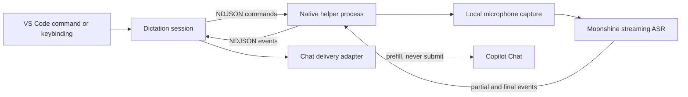

# Copilot Speech

Private, local voice dictation for GitHub Copilot Chat in desktop VS Code.

Copilot Speech records from the microphone on your computer, transcribes with a local streaming speech model, and prefills Copilot Chat so you can review the prompt before sending it. Audio and transcripts are not sent to a cloud transcription service.

> [!IMPORTANT]
> This repository is an implementation draft. The VS Code extension, process protocol, Chat delivery, tests, CI, model metadata, and native helper stub are working. Microphone capture, Moonshine inference, managed runtime downloads, and signed release artifacts are the next implementation phase.

## Direction

- English-first local dictation.
- Moonshine Voice v2 Medium Streaming as the quality default.
- Moonshine Small Streaming as a faster, lighter option.
- True streaming partial transcripts and voice activity detection.
- Review-before-send Chat integration.
- A local UI extension host, including Remote SSH, WSL, and Dev Container windows.
- No transcript history, audio retention, automatic prompt submission, or speech telemetry.

Medium Streaming's required transcription files are about 289 MiB before the native runtime. Small Streaming is about 157 MiB. Size remains important, but recognition quality and usable latency take priority over a hard 200 MB ceiling.

## Current Draft

The extension currently provides:

- Start, stop, cancel, microphone selection, diagnostics, and settings commands.
- `Ctrl+Alt+V` on Windows/Linux or `Cmd+Alt+V` on macOS to toggle dictation.
- A status bar control and a `chat/input/status` contribution.
- A versioned newline-delimited JSON protocol over stdio.
- An isolated native helper process boundary.
- Copilot Chat prefill through `workbench.action.chat.open` with `isPartialQuery: true`.
- Clipboard fallback when Chat prefill is unavailable.
- A C++ protocol stub for end-to-end development and CI.

The helper stub can produce a synthetic transcript, but it does not access the microphone yet.

## Architecture



The helper owns raw audio, capture, VAD, and inference. Raw PCM never enters the extension host. A helper crash cannot take down VS Code's extension host, and the protocol remains testable without Electron or Node native-addon ABI coupling.

## Development

Requirements:

- Node.js 24
- pnpm 11
- CMake 3.20 or newer
- A C++20 compiler

Install and validate the TypeScript extension:

```bash
pnpm install
pnpm check
pnpm ext:package
```

Build the native protocol stub:

```bash
pnpm native:configure
pnpm native:build
pnpm native:test
```

Set `copilotSpeech.helperPath` to the built executable. On Linux that is normally:

```text
native/voice-helper/build/copilot-speech-helper
```

To exercise the draft end to end, launch VS Code with a synthetic final transcript:

```bash
COPILOT_SPEECH_STUB_TRANSCRIPT="Explain the selected function" code .
```

Start dictation, then stop it. The helper emits the synthetic transcript and Copilot Speech prefills Chat without submitting.

## Models

The draft model catalog is stored in `artifacts/model-manifest.json`.

| Model | Parameters | Required model files | Role |
| --- | ---: | ---: | --- |
| Moonshine Medium Streaming English | 245M | 303,329,727 bytes | Default, best quality |
| Moonshine Small Streaming English | 123M | 164,689,974 bytes | Lower-resource option |

The optional `decoder_kv_with_attention.ort` files are excluded because word-level timestamps are not required for dictation and would duplicate roughly one decoder's worth of storage.

Published model URLs are recorded, but SHA-256 values remain intentionally marked pending until the project pins immutable release artifacts. Production code must not install or execute artifacts without digest verification.

## Privacy

- Audio stays inside the native helper and is not retained by default.
- Final transcripts are held only long enough to deliver or offer recovery after an error.
- Logs contain state, versions, timing, and error codes, not transcript text or audio.
- Chat prompts are prefilled for review and never automatically submitted.
- Network access will be limited to explicit model/runtime installation and updates.

## Remote Workspaces

The extension declares `extensionKind: ["ui"]`. It runs next to the desktop UI and local microphone while source files may live in Remote SSH, WSL, or Dev Containers. Browser-hosted VS Code is out of scope because it cannot run the native helper.

## Roadmap

1. Pin Moonshine Voice and ONNX Runtime source revisions.
2. Replace the protocol stub with Moonshine streaming inference.
3. Add WASAPI, Core Audio, PulseAudio, and ALSA microphone capture.
4. Publish signed helpers for Linux, macOS, and Windows.
5. Add checksum-verified model/runtime installation under `globalStorageUri`.
6. Benchmark Medium and Small on representative hardware and tune endpointing.
7. Run clean-machine microphone permission and remote-workspace acceptance tests.

## License

Copilot Speech is licensed under MIT. See `THIRD_PARTY_NOTICES.md` for planned runtime and model dependencies.
